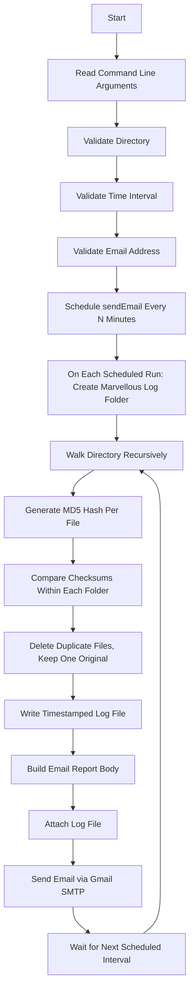
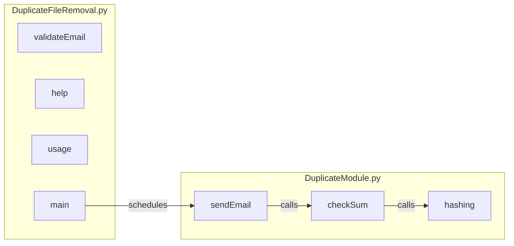

# 🧹 Duplicate File Removal Automation

**A Python CLI automation tool that finds and removes duplicate files using MD5 checksums, then emails a scheduled report.**


---

## 📑 Table of Contents

- [Overview](#-overview)
- [Features](#-features)
- [How It Works](#️-how-it-works)
- [Project Architecture](#️-project-architecture)
- [Project Structure](#-project-structure)
- [Key Learning Outcomes](#-key-learning-outcomes)
- [Requirements](#-requirements)
- [Installation](#-installation)
- [Command Line Usage](#-command-line-usage)
- [Help & Usage Commands](#-help--usage-commands)
- [Sample Log Output](#-sample-log-output)
- [Log File Contents](#-log-file-contents)
- [Email Report](#-email-report)
- [Input Validation](#-input-validation)
- [Exception Handling](#-exception-handling)
- [Performance Notes](#-performance-notes)
- [Security Notes](#-security-notes)
- [Important Notes](#-important-notes)
- [Screenshots](#️-screenshots)
- [Future Improvements](#-future-improvements)
- [Author](#-author)
- [License](#-license)

---

## 📖 Overview

**Problem:** Duplicate files quietly pile up inside folders over time — wasting storage and turning manual cleanup into a slow, error-prone chore.

**Solution:** Duplicate File Removal Automation scans a target directory, uses **MD5 checksums** to identify exact duplicate files, removes the redundant copies while preserving one original, and repeats this automatically on a schedule.

**Benefit:** Once started, it runs unattended — every cycle produces a timestamped, auditable log and an emailed report, so storage stays clean and every deletion stays traceable.

---

## ✨ Features

#### 🧠 Core Features
- 🔁 Recursive directory walk using `os.walk`
- 🔑 Duplicate detection via MD5 checksum comparison
- 🗑️ Automatic deletion of duplicate files (one copy is always preserved)
- 🧩 Modular design — CLI/validation logic separated from the core duplicate-removal logic

#### ⏱️ Automation Features
- ⏱️ Periodic execution using the `schedule` library
- 💻 Command-line interface with argument-based configuration
- ❓ Built-in `--help` command
- 📘 Built-in `--usage` command

#### ✅ Validation Features
- Input validation (directory existence, absolute path, numeric interval, interval > 0)
- 📮 Email address validation via regular expressions
- 🧯 Exception handling around scanning, deletion, and email sending

#### 📊 Reporting Features
- 🕒 Timestamped log file generated for every run, saved under `Marvellous/`
- 📊 Run statistics: total files scanned, duplicates found, files deleted
- 📧 Automatic email report after every scheduled execution
- 📎 Log file attached to the report email

---

## ⚙️ How It Works



> **Note:** Duplicate comparison happens **per folder** as the directory is walked — files are hashed and compared against other files in the *same* folder, not against files in every other subfolder.

---

## 🏗️ Project Architecture



---

## 📂 Project Structure

```text
Duplicate-File-Removal-Automation/
│
├── DuplicateFileRemoval.py
├── DuplicateModule.py
├── README.md
├── requirements.txt
├── .gitignore
├── LICENSE
│
├── screenshots/
│   ├── execution.png
│   ├── email.png
│   ├── log.png
│   ├── before_cleanup.png
│   └── after_cleanup.png
│
└── Marvellous/
    └── DuplicateRemovalLog_....log
```

---

## 🎓 Key Learning Outcomes

This project demonstrates hands-on experience with:

- **File Handling** — reading files in buffered chunks for hashing
- **MD5 Hashing** — content-based duplicate detection using `hashlib`
- **Directory Traversal** — recursive scanning with `os.walk`
- **Regular Expressions** — email address validation with `re`
- **SMTP Email Automation** — sending mail programmatically via `smtplib`
- **Email Attachments** — building multipart messages with `email.message`
- **Python Scheduling** — recurring task execution with the `schedule` library
- **Command Line Interfaces** — argument parsing and validation via `sys.argv`
- **Exception Handling** — graceful failure recovery during I/O and network operations
- **Modular Programming** — separating CLI/validation logic from core processing logic

---

## 🧰 Requirements

- Python 3.x
- A Gmail account with an **App Password** for SMTP sending

**Libraries used:**

| Library | Purpose |
|---|---|
| `hashlib` | MD5 checksum generation |
| `os` | Directory walking, path handling |
| `datetime` | Timestamps for logs and reports |
| `schedule` | Periodic scheduled execution |
| `re` | Email address validation |
| `smtplib` | Sending email via Gmail SMTP |
| `email.message` | Building the email with attachment |
| `sys` | Reading command-line arguments |
| `time` | Sleep between scheduler checks |

---

## 🚀 Installation

**1. Clone the repository**
```bash
git clone <repository-url>
cd Duplicate-File-Removal-Automation
```

**2. (Optional) Create a virtual environment**
```bash
python -m venv venv
source venv/bin/activate      # macOS/Linux
venv\Scripts\activate         # Windows
```

**3. Install dependencies**
```bash
pip install -r requirements.txt
```

**4. Configure email credentials**
> ⚠️ The script sends email from a Gmail account and expects a sender address and an **App Password** to be configured in `DuplicateModule.py`. Never commit real credentials to the repository — prefer environment variables or a local config file excluded via `.gitignore` over hardcoding them.

**5. Run the project**
```bash
python DuplicateFileRemoval.py <AbsoluteDirectoryPath> <TimeIntervalInMinutes> <ReceiverEmail>
```

---

## 💻 Command Line Usage

```bash
python DuplicateFileRemoval.py <AbsoluteDirectoryPath> <TimeIntervalInMinutes> <ReceiverEmail>
```

**Example:**

```bash
python DuplicateFileRemoval.py E:\Data\Demo 50 example@gmail.com
```

---

## ❓ Help & Usage Commands

```bash
python DuplicateFileRemoval.py --help
python DuplicateFileRemoval.py --usage
```

| Command | Aliases | Shows |
|---|---|---|
| Help | `--h`, `--H`, `--help`, `--Help` | Purpose, usage syntax, and an example |
| Usage | `--u`, `--U`, `--usage`, `--Usage` | A description of each command-line argument |

**Arguments:**

| Argument | Description |
|---|---|
| `AbsoluteDirectoryPath` | Absolute path of the directory to scan recursively |
| `TimeIntervalInMinutes` | How often (in minutes) the scan-and-report cycle repeats |
| `ReceiverEmailAddress` | Email address that receives the operation report |

---

## 🧾 Sample Log Output

> Illustrative only — generated from the same format `checkSum()` actually writes.

```text
--------------------------------------------------
Marvellous Automation Script 
Starting Time Of Scanning: 25-07-2026 10:15:32 AM 
Name Of The Directory Scanned: D:\Projects\SampleData 
--------------------------------------------------
--------------------------------------------------
Duplicate File Pair Found! 
--------------------------------------------------
Duplicate File 1: D:\Projects\SampleData\report.docx 
Duplicate File 2: D:\Projects\SampleData\report_copy.docx 
CheckSum Value Of The File1: 9a0364b9e99bb480dd25e1f0284c8555 
CheckSum Value Of The File2: 9a0364b9e99bb480dd25e1f0284c8555 
--------------------------------------------------
--------------------------------------------------
Total number of files scanned: 42 
Total number of duplicate files found: 3 
Total number of duplicates removed: 3 
Ending Time Of Scanning: 25-07-2026 10:15:41 AM 
```

---

## 📝 Log File Contents

Every run writes a timestamped log to `Marvellous/`, containing:

- Starting time of the scan
- Directory scanned
- Each duplicate pair found, with both file paths and their MD5 checksum values
- Total number of files scanned
- Total number of duplicates found
- Total number of duplicates removed
- Ending time of the scan
- Any exceptions encountered during scanning or deletion

---

## 📧 Email Report

After every scheduled run, an email is sent to the configured receiver containing:

- Start and completion time of the scan
- Directory that was scanned
- Total files scanned, duplicates found, and duplicates deleted
- The full log file attached as a text attachment

---

## ✅ Input Validation

- Argument count is validated (2 args for `--help`/`--usage`, 4 args for a normal run)
- Time interval must be numeric
- Time interval must be greater than 0
- Directory must exist (`os.path.isdir`)
- Directory path must be absolute (`os.path.isabs`)
- Receiver email must match a valid email pattern via regex

---

## 🧯 Exception Handling

- Errors while scanning the directory are caught and written to the log
- Errors while deleting a duplicate file are caught per-file and logged, without stopping the run
- Errors while sending the email (SMTP failures, login issues) are caught and printed to the console

---

## 📈 Performance Notes

- **Current approach:** For every folder visited, each file is compared against every other file in that *same* folder by computing and comparing MD5 hashes — a pairwise, per-folder comparison rather than a single global pass over the whole tree.
- **Time complexity:** Roughly O(k²) per folder, where *k* is the number of files in that folder. Note that a file's hash is recomputed on every pairwise comparison rather than cached once, which adds redundant hashing work on top of the pairwise cost itself.
- **Memory usage:** Low — files are hashed by reading them in small buffered chunks (1000 bytes at a time) rather than loading entire files into memory.
- **Suitable use cases:** Small to medium folders with a moderate number of files each; very large, flat folders (thousands of files in a single directory) will be noticeably slower because of the pairwise comparisons and repeated hashing.
- **Possible future optimization:** Hash each file once, group files by hash value in a dictionary, and treat any group with more than one entry as duplicates — turning the per-folder cost from pairwise into a single pass per file.

---

## 🔐 Security Notes

- **Never commit real credentials** — the sender email and Gmail App Password must not be hardcoded and pushed to a public repository.
- **Use a Gmail App Password**, not your actual account password, for SMTP login.
- **Prefer environment variables** (or a local `.env` file excluded via `.gitignore`) to supply credentials at runtime instead of hardcoding them in `DuplicateModule.py`.
- **Protect SMTP credentials** the same way you would any other secret, and rotate them immediately if they're ever exposed.
- **Do not expose sensitive information** (email addresses, passwords, tokens) anywhere in the public repository, including in commit history.

---

## 📌 Important Notes

- Only files with **identical MD5 checksums** are treated as duplicates
- One original copy of every duplicate set is always preserved
- **Deleted files cannot be recovered**
- Duplicate comparison is scoped to files within the same folder during the walk, not the entire tree at once

---

## 🖼️ Screenshots

### 📌 Program Execution
(Add execution.png)

---

### 📌 Generated Log File
(Add log.png)

---

### 📌 Email Report
(Add email.png)

---

### 📌 Folder Before Cleanup
(Add before_cleanup.png)

---

### 📌 Folder After Cleanup
(Add after_cleanup.png)

---

## 🔮 Future Improvements

- SHA-256 (or stronger) hashing as an option
- Hash dictionary optimization for faster, non-pairwise duplicate grouping
- Global duplicate detection across the entire directory tree, not just per-folder
- Multi-threaded/parallel hashing for large directories
- Move to a trash/recycle folder instead of permanent deletion
- External configuration file instead of hardcoded credentials
- Cloud storage support
- GUI version
- Progress bar during scanning

---

## 👤 Author

**Vivaan Kukreja**

---

## 📄 License

Licensed under the [MIT License](LICENSE).
